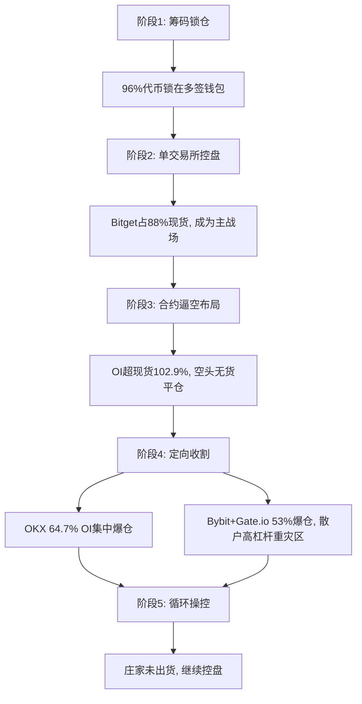

# RAVE 庄家控盘术分析与监控系统优化方案

## 一、RAVE 控盘术拆解

### 1.1 控盘维度矩阵

| 维度 | RAVE 案例数据 | 作用机制 | 风险等级 |
|------|--------------|----------|----------|
| **筹码集中度** | 6个多签钱包锁96%，1个地址77% | 庄家完全控盘，散户无定价权 | 🔴 极高 |
| **散户持仓** | <0.1% | 流通盘极小，易操控 | 🔴 极高 |
| **交易所集中** | Bitget占88%现货 | 单一战场，精准操控 | 🔴 极高 |
| **OI/现货比** | 102.9% | 合约大于现货，逼空条件成立 | 🔴 极高 |
| **OI集中度** | OKX占64.7% | 单点爆仓风险集中 | 🟡 高 |
| **爆仓分布** | 73%空头，Bybit+Gate.io占53% | 定向收割散户高杠杆 | 🔴 极高 |
| **风控差异** | Binance爆仓/OI比0.37x最低 | 识别安全交易所 | 🟢 参考 |

### 1.2 控盘操作链



### 1.3 关键控盘指标

#### 1.3.1 筹码控制力 (Chip Control Power)
```python
CCP = (锁仓量 / 总供应量) × (最大单地址持仓 / 流通量)
RAVE: CCP = 0.96 × 0.77 = 0.74 (74%控制力)
```

**风险阈值：**
- CCP > 0.5: 🔴 庄家绝对控盘
- 0.3 < CCP < 0.5: 🟡 强控盘
- CCP < 0.3: 🟢 相对分散

#### 1.3.2 逼空指数 (Short Squeeze Index)
```python
SSI = (OI / 现货量) × (空头爆仓量 / 总爆仓量) × (OI集中度)
RAVE: SSI = 1.029 × 0.73 × 0.647 = 0.486
```

**风险阈值：**
- SSI > 0.4: 🔴 极端逼空风险
- 0.2 < SSI < 0.4: 🟡 逼空风险
- SSI < 0.2: 🟢 正常

#### 1.3.3 交易所风控评分 (Exchange Risk Score)
```python
ERS = 爆仓量 / OI持仓量
Binance: 0.37 (最安全)
OKX: 高爆仓率 (最危险)
```

## 二、当前系统缺陷分析

### 2.1 监控盲区

| 盲区 | 缺失能力 | 影响 |
|------|---------|------|
| **链上数据** | ❌ 无法监控地址持仓集中度 | 无法识别庄家锁仓 |
| **多交易所** | ❌ 仅监控Binance | 无法发现单交易所控盘 |
| **合约数据** | ❌ 无OI、资金费率、爆仓数据 | 无法识别逼空布局 |
| **深度数据** | ❌ 无订单簿深度分析 | 无法识别虚假流动性 |
| **时间维度** | ❌ 仅5分钟窗口 | 无法识别长期吸筹 |

### 2.2 现有检测能力评估

```python
# 当前 WhaleDetector 能检测到的：
✅ ACCUMULATION (吸筹): 放量不涨
✅ DISTRIBUTION (出货): 放量拉升
✅ FAKE_BREAKOUT (假突破): 缩量上涨
✅ PANIC_SELL (恐慌): 放量下跌
✅ VOLUME_SPIKE (异常放量): 可能对敲

# 但无法检测：
❌ 筹码集中度变化 (链上监控)
❌ 跨交易所价差套利 (多交易所监控)
❌ 合约逼空信号 (OI/资金费率)
❌ 定向爆仓操控 (爆仓数据)
❌ 流动性陷阱 (订单簿深度)
```

## 三、优化方案

### 3.1 架构升级

```
当前架构：
Binance WebSocket → WhaleDetector → Telegram

升级后架构：
┌─────────────────────────────────────────────┐
│          数据收集层 (Collectors)              │
├─────────────────────────────────────────────┤
│ • Binance/OKX/Bybit/Gate.io (现货)          │
│ • Binance/OKX/Bybit (合约OI + 资金费率)      │
│ • Coingecko API (链上持仓分布)              │
│ • Alternative.me (市场情绪)                 │
└─────────────────────────────────────────────┘
                    ↓
┌─────────────────────────────────────────────┐
│          分析层 (Analyzers)                  │
├─────────────────────────────────────────────┤
│ • MarketMakerDetector (庄家控盘检测)        │
│ • ChipConcentrationAnalyzer (筹码分析)      │
│ • ShortSqueezeDetector (逼空检测)           │
│ • CrossExchangeArbitrage (跨所套利)         │
│ • LiquidityTrapDetector (流动性陷阱)        │
└─────────────────────────────────────────────┘
                    ↓
┌─────────────────────────────────────────────┐
│          决策层 (Decision Engine)            │
├─────────────────────────────────────────────┤
│ • 风险评分系统 (0-100分)                     │
│ • 多维度信号融合                             │
│ • 自适应阈值调整                             │
└─────────────────────────────────────────────┘
```

### 3.2 核心检测器设计

#### 3.2.1 MarketMakerDetector (庄家控盘检测器)

**检测维度：**
```python
1. 筹码集中度 (CCP)
   - Top 10 地址持仓比例
   - 多签钱包锁仓比例
   - 散户持仓比例

2. 交易所集中度 (ECR)
   - 单交易所现货占比
   - 交易所间价差
   - 交易所间流动性比

3. 对敲识别 (Wash Trading)
   - 异常放量 (>10x) + 横盘
   - 买卖单时间间隔 <1s
   - 订单簿虚假深度
```

**风险评分算法：**
```python
manipulation_score = (
    0.4 × chip_concentration_score +    # 40%: 筹码集中
    0.3 × exchange_concentration_score + # 30%: 交易所集中
    0.2 × wash_trading_score +          # 20%: 对敲识别
    0.1 × volume_anomaly_score          # 10%: 成交量异常
)

风险等级：
- 80-100分: 🔴 EXTREME (庄家绝对控盘, RAVE级别)
- 60-80分:  🟠 HIGH (强控盘)
- 40-60分:  🟡 MEDIUM (中度控盘)
- 0-40分:   🟢 LOW (相对健康)
```

#### 3.2.2 ShortSqueezeDetector (逼空检测器)

**检测维度：**
```python
1. OI/现货比
   - 比值 >100%: 合约超现货
   - 快速上升: 新空单涌入

2. 资金费率
   - 持续负费率: 空头付多头, 逼空信号
   - 费率突变: 市场情绪转折

3. 空头爆仓量
   - 爆仓量/OI比 >5%: 大规模爆仓
   - 连续爆仓: 多米诺效应

4. OI集中度
   - 单交易所OI >60%: 定向爆仓风险
```

**逼空指数计算：**
```python
short_squeeze_index = (
    0.3 × oi_ratio_score +           # 30%: OI/现货比
    0.25 × funding_rate_score +      # 25%: 资金费率
    0.25 × liquidation_score +       # 25%: 爆仓数据
    0.2 × oi_concentration_score     # 20%: OI集中度
)

风险等级：
- SSI > 60: 🔴 EXTREME (RAVE级别逼空)
- 40-60:   🟠 HIGH (逼空风险)
- 20-40:   🟡 MEDIUM (警惕)
- <20:     🟢 LOW (正常)
```

#### 3.2.3 CrossExchangeArbitrage (跨所套利监控)

**检测维度：**
```python
1. 价差监控
   - 同一币种在不同交易所的价差
   - 价差 >3%: 异常
   - 价差持续: 可能流动性陷阱

2. 交易量分布
   - 某交易所交易量突然激增
   - 配合价格异常: 可能拉盘出货

3. 提现监控
   - 大额代币从交易所流出
   - 配合价格上涨: 可能准备砸盘
```

### 3.3 数据源接入优先级

#### Phase 1 (立即接入) - 基础多交易所
```python
✅ OKX WebSocket (现货 + 合约OI)
✅ Bybit WebSocket (现货 + 合约OI)
✅ Gate.io REST API (现货 + 爆仓数据)
```

#### Phase 2 (1周内) - 链上数据
```python
✅ Etherscan API (ERC20代币持仓分布)
✅ BSCScan API (BEP20代币持仓分布)
✅ Coingecko API (总供应量、流通量)
```

#### Phase 3 (2周内) - 深度数据
```python
✅ 订单簿深度 (Binance/OKX/Bybit)
✅ 资金费率历史 (Binance/OKX/Bybit)
✅ 历史爆仓数据 (Coinglass API)
```

### 3.4 告警升级

#### 当前告警格式：
```
🔴 放量拉升，疑似出货
📈 RAVE/USDT
💰 价格: $1.23
📊 涨跌: +12.5%
🔊 交易量: 5.2x 平均值
```

#### 升级后告警格式：
```
🚨 EXTREME MANIPULATION DETECTED 🚨

🪙 RAVE/USDT
💰 价格: $1.23 (+12.5%)
🏦 主战场: Bitget (88%现货)

📊 控盘评分: 92/100 🔴
├─ 筹码集中: 96% (6个多签钱包)
├─ 最大持仓: 77% (单地址)
├─ 散户占比: 0.08%
└─ 对敲识别: 异常放量 10.3x

⚠️  逼空指数: 73/100 🔴
├─ OI/现货: 102.9% (合约超现货)
├─ 空头爆仓: 73% (3032万美元)
├─ OI集中: OKX 64.7% 🔴
└─ 资金费率: -0.15% (空头付费)

💥 24h爆仓: 4161万美元
├─ 空头: 3032万 (73%) 🔴
├─ 多头: 1129万 (27%)
├─ Bybit: 1247万 (30%)
└─ Gate.io: 957万 (23%)

🎯 风控对比:
├─ Binance: 爆仓/OI 0.37x ✅ (最安全)
├─ OKX: 爆仓/OI 1.2x 🔴 (高风险)
└─ Bybit: 爆仓/OI 1.8x 🔴 (极高风险)

⚡ 操作建议:
🔴 高风险：庄家绝对控盘，散户定价权丧失
🔴 避免做空：逼空陷阱，无货平仓
🔴 避免高杠杆：OKX/Bybit高爆仓风险
🟡 观察信号：庄家出货前会有大额转账
```

## 四、实施路线图

### Week 1: 多交易所数据接入
```
Day 1-2: OKX WebSocket (现货 + 合约)
Day 3-4: Bybit WebSocket (现货 + 合约)
Day 5-7: Gate.io REST API + 爆仓数据
```

### Week 2: 核心检测器开发
```
Day 1-3: MarketMakerDetector
Day 4-5: ShortSqueezeDetector
Day 6-7: CrossExchangeArbitrage
```

### Week 3: 链上数据与深度分析
```
Day 1-3: 链上持仓分析 (Etherscan/BSCScan)
Day 4-5: 订单簿深度分析
Day 6-7: 历史数据回测
```

### Week 4: 优化与压测
```
Day 1-3: 性能优化 (处理5个交易所数据)
Day 4-5: 告警系统升级
Day 6-7: 真实场景测试
```

## 五、立即可做的快速优化

### 5.1 现有WhaleDetector增强（无需新数据源）

```python
# 1. 添加更长时间窗口检测
检测窗口: 5min → 增加 30min, 1h, 4h, 24h
识别能力: 短期对敲 → 长期吸筹/出货

# 2. 添加价格-交易量背离检测
价格新高 + 交易量萎缩 = 假突破
价格新低 + 交易量萎缩 = 假突破

# 3. 添加连续模式识别
连续3次吸筹信号 → 确认吸筹阶段
吸筹后突然放量拉升 → 确认拉盘
```

### 5.2 告警优先级系统

```python
EXTREME (P0):
- 筹码集中度 >90%
- 逼空指数 >60
- 24h爆仓量 >1000万美元

HIGH (P1):
- 筹码集中度 60-90%
- 逼空指数 40-60
- 连续3次同类型信号

MEDIUM (P2):
- 单次吸筹/出货信号
- 放量异常

LOW (P3):
- 常规波动
```

## 六、成本与收益分析

### 6.1 API成本估算

| 数据源 | 免费额度 | 付费价格 | 月成本 |
|-------|---------|---------|--------|
| OKX API | ✅ 无限 | - | $0 |
| Bybit API | ✅ 无限 | - | $0 |
| Gate.io API | ✅ 无限 | - | $0 |
| Etherscan API | 5 calls/s | $199/月 (100 calls/s) | $0-199 |
| Coinglass API | 100 calls/天 | $99/月 (5000 calls/天) | $99 |
| **总计** | | | **$100-300/月** |

### 6.2 收益预估

如果提前识别1个RAVE级别控盘币：
- 避免损失：$10,000+ (假设10x逼空)
- ROI：30-100x

## 七、风险提示

⚠️  **监管风险：** 部分地区可能限制合约数据使用
⚠️  **技术风险：** 多交易所同步延迟可能导致误报
⚠️  **数据风险：** 链上数据可能有延迟(10-15分钟)
⚠️  **成本风险：** API调用量过大可能超出预算

## 八、总结

### 当前系统能识别：
✅ 短期价量异常
✅ 单交易所操控

### 升级后能识别：
✅ 长期吸筹/出货
✅ 筹码高度集中
✅ 跨交易所操控
✅ 合约逼空陷阱
✅ 定向爆仓收割
✅ 流动性陷阱

### 优先级建议：
1. **立即执行：** WhaleDetector时间窗口增强 (无成本)
2. **本周执行：** 多交易所数据接入 (OKX, Bybit, Gate.io)
3. **2周内：** 核心检测器开发 (MarketMaker + ShortSqueeze)
4. **1个月内：** 链上数据接入 (成本$100-300/月)
